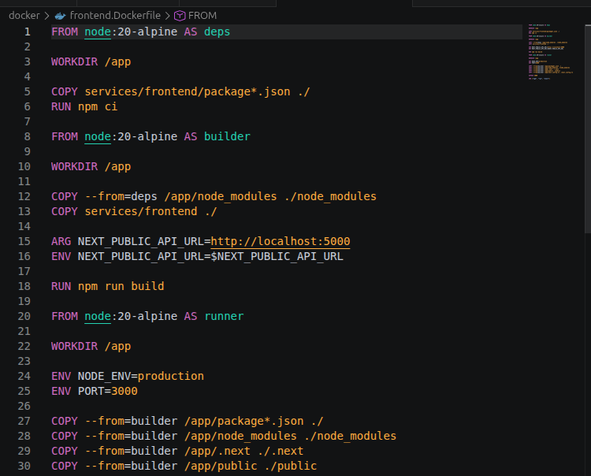
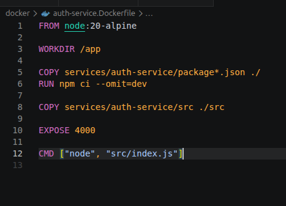
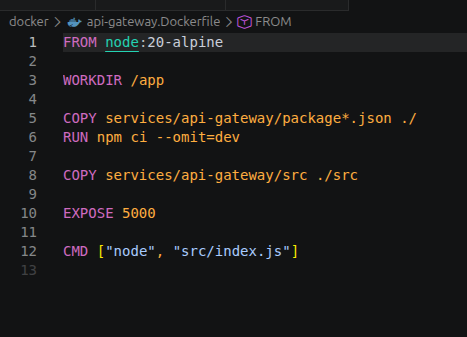
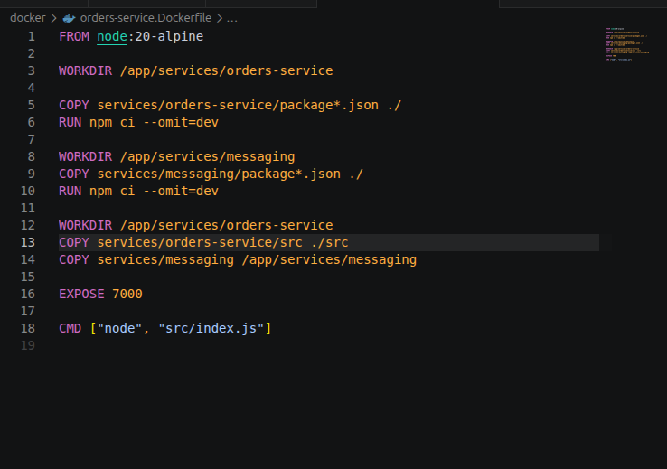
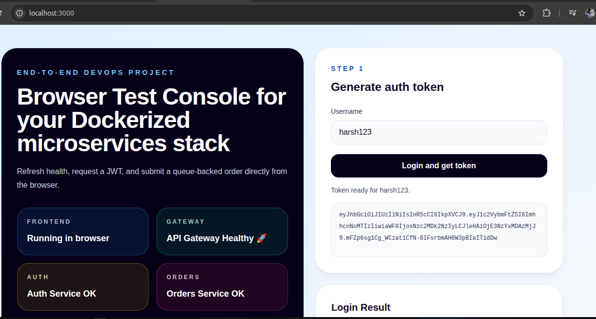
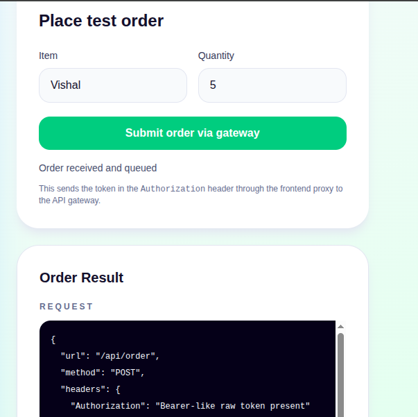
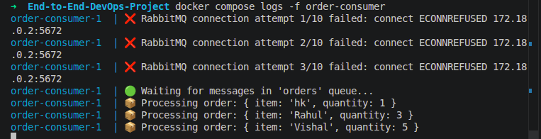

# Stage 2: Docker Compose

Stage 2 containerizes the complete application stack. All app services, Redis, and RabbitMQ run through Docker Compose.

## Goal

- Build Docker images for the app services.
- Run the full stack with one Compose command.
- Verify service-to-service communication inside the Docker network.
- Confirm queue processing through the order consumer logs.

## Services

| Service | Container role | Host port |
| --- | --- | --- |
| `frontend` | Next.js frontend | `3000` |
| `api-gateway` | Public API gateway | `5000` |
| `auth-service` | Login and JWT service | `4000` |
| `orders-service` | Order API and queue producer | `7000` |
| `order-consumer` | RabbitMQ consumer | No host port |
| `redis` | Cache dependency | `6379` |
| `rabbitmq` | Queue dependency | `5672`, `15672` |

## Main Files

- `docker-compose.yml`
- `docker/frontend.Dockerfile`
- `docker/api-gateway.Dockerfile`
- `docker/auth-service.Dockerfile`
- `docker/orders-service.Dockerfile`
- `smoke-test.sh`

## Prerequisites

- Docker installed.
- Docker Compose available through `docker compose`.
- Stage 1 local services stopped so ports are free.

If Stage 1 is still running, stop the local Node.js processes and run:

```bash
docker compose down
```

## 1. Build and Start the Stack

Run from the project root:

```bash
docker compose up --build -d
```

This builds and starts:

- `frontend`
- `api-gateway`
- `auth-service`
- `orders-service`
- `order-consumer`
- `redis`
- `rabbitmq`

## 2. Check Container Status

```bash
docker compose ps
```

Expected result:

- Redis and RabbitMQ show `healthy`.
- App containers show `Up`.
- Host ports `3000`, `4000`, `5000`, `7000`, `6379`, `5672`, and `15672` are published.

## 3. Verify the Application

Run the smoke test:

```bash
./smoke-test.sh
```

The script checks:

- frontend responds
- API gateway `/health` responds
- auth service `/health` responds
- orders service `/health` responds
- `/login` returns a JWT
- `/order` submits a test order through the API gateway
- `order-consumer` logs show the submitted test item

## 4. Useful Logs

Watch all logs:

```bash
docker compose logs -f
```

Watch the order consumer:

```bash
docker compose logs -f order-consumer
```

Watch a single app service:

```bash
docker compose logs -f api-gateway
```

## 5. Shutdown

Stop and remove the Stage 2 stack:

```bash
docker compose down
```

If you also want to remove local images, do that separately after confirming they are not needed.

## Completion Checklist

- Docker images build successfully.
- All seven services start through Docker Compose.
- Redis and RabbitMQ are healthy.
- Frontend is available at `http://localhost:3000`.
- Smoke test passes.
- Consumer logs contain the submitted order item.

## Screenshots

The Stage 2 screenshot set is stored in [screenshots/stage2-ss](../screenshots/stage2-ss/).










