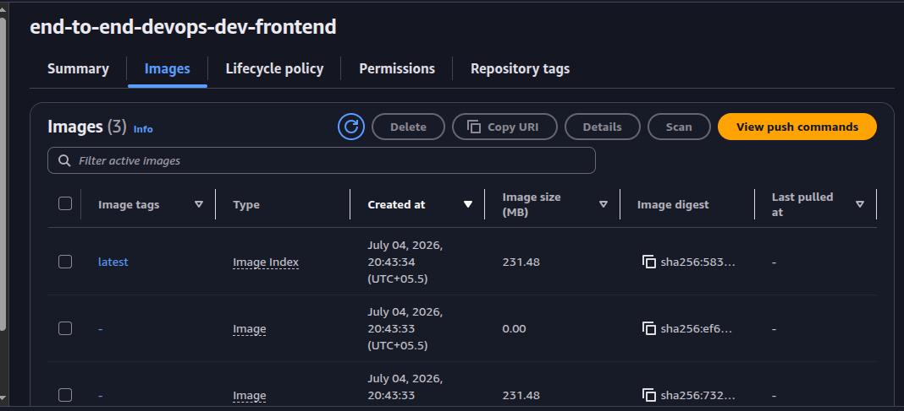
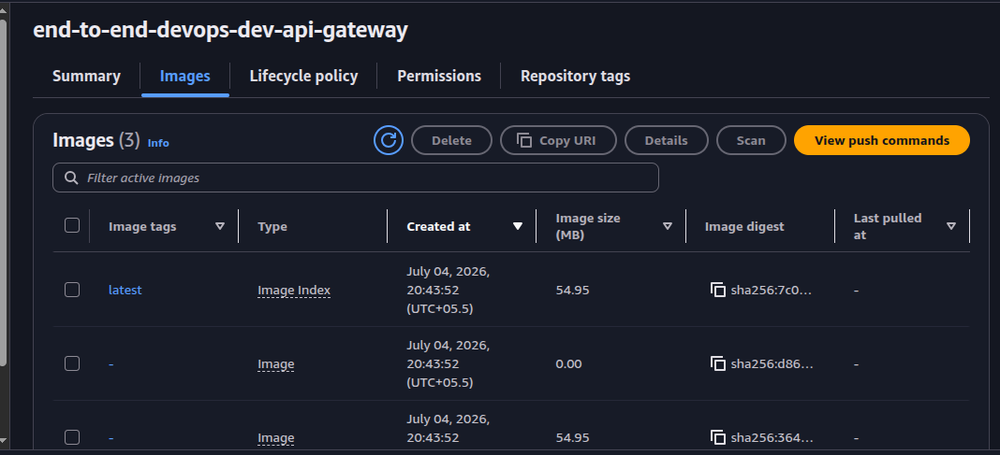
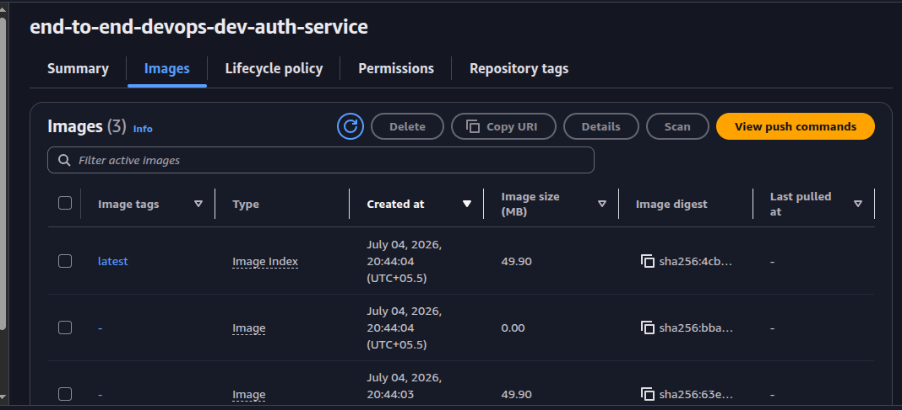
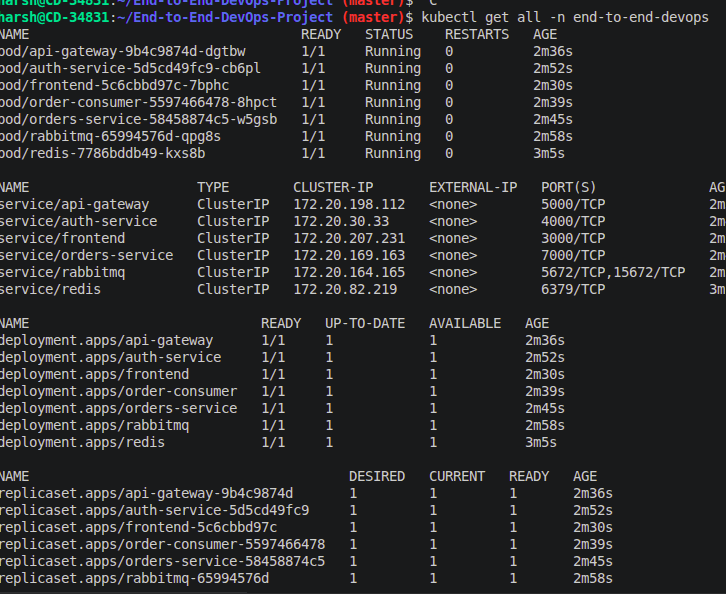

# Stage 4: Kubernetes Deployment

Stage 4 deploys the Dockerized application to Kubernetes on EKS. The manifests live under `k8s/base` and are intentionally plain YAML so they can later be converted to Helm charts.

## Goal

- Build and push app images to ECR.
- Apply Kubernetes manifests to the EKS cluster.
- Run Redis, RabbitMQ, app services, and the order consumer in Kubernetes.
- Expose frontend and API gateway through an Ingress placeholder.
- Verify pods, services, ingress, events, and logs.

## Main Files

- `k8s/build-and-push-images.sh`
- `k8s/apply-stage4.sh`
- `k8s/verify-stage4.sh`
- `k8s/base/namespace.yaml`
- `k8s/base/configmap.yaml`
- `k8s/base/secret.example.yaml`
- `k8s/base/*-deployment.yaml`
- `k8s/base/*-service.yaml`
- `k8s/base/ingress.yaml`

## Kubernetes Resources

- Namespace: `end-to-end-devops`
- ConfigMap: `app-config`
- Secret: `app-secrets`
- Deployments:
  - `frontend`
  - `api-gateway`
  - `auth-service`
  - `orders-service`
  - `order-consumer`
  - `redis`
  - `rabbitmq`
- Services:
  - `frontend`
  - `api-gateway`
  - `auth-service`
  - `orders-service`
  - `redis`
  - `rabbitmq`
- Ingress:
  - `frontend.local`
  - `api.local`

## Prerequisites

- Stage 3 infrastructure is already applied.
- EKS cluster is active.
- ECR repositories exist.
- Docker is installed.
- AWS CLI is authenticated.
- `kubectl` is installed.
- An ingress controller is installed if you want Ingress routing to work.

## 1. Connect kubectl to EKS

```bash
aws eks update-kubeconfig --region ap-south-1 --name end-to-end-devops-dev-eks
```

Verify cluster access:

```bash
kubectl get nodes
```

## 2. Prepare Secrets

For demo use, the current helper script applies:

```text
k8s/base/secret.example.yaml
```

Before applying to a real cluster, replace the placeholder `JWT_SECRET`.

For safer local workflow, keep the example file as a placeholder and store the real value in ignored file:

```bash
cp k8s/base/secret.example.yaml k8s/base/secret.yaml
```

Then update the apply command or manually apply `secret.yaml`.

Important: do not commit real secret values.

## 3. Build and Push Images

Run from the project root:

```bash
./k8s/build-and-push-images.sh
```

Optional overrides:

```bash
AWS_ACCOUNT_ID=198452822403 AWS_REGION=ap-south-1 IMAGE_TAG=v1 ./k8s/build-and-push-images.sh
```

The script builds and pushes:

- `frontend`
- `api-gateway`
- `auth-service`
- `orders-service`

## 4. Apply Manifests

```bash
./k8s/apply-stage4.sh
```

The script applies resources in this order:

1. namespace
2. config map and secret
3. Redis and RabbitMQ
4. backend services
5. frontend
6. ingress

## 5. Verify

```bash
./k8s/verify-stage4.sh
```

Optional:

```bash
NAMESPACE=end-to-end-devops LOG_LINES=100 ./k8s/verify-stage4.sh
```

Useful manual checks:

```bash
kubectl get all -n end-to-end-devops
kubectl get ingress -n end-to-end-devops
kubectl get pods -n end-to-end-devops -o wide
kubectl get events -n end-to-end-devops --sort-by=.lastTimestamp
```

Check logs:

```bash
kubectl logs deployment/frontend -n end-to-end-devops --tail=50
kubectl logs deployment/api-gateway -n end-to-end-devops --tail=50
kubectl logs deployment/auth-service -n end-to-end-devops --tail=50
kubectl logs deployment/orders-service -n end-to-end-devops --tail=50
kubectl logs deployment/order-consumer -n end-to-end-devops --tail=50
```

## 6. Full Stage 4 Flow

```bash
aws eks update-kubeconfig --region ap-south-1 --name end-to-end-devops-dev-eks
./k8s/build-and-push-images.sh
./k8s/apply-stage4.sh
./k8s/verify-stage4.sh
```

## Completion Checklist

- ECR contains latest app images.
- Namespace `end-to-end-devops` exists.
- ConfigMap and Secret are applied.
- Redis and RabbitMQ pods are running.
- Frontend, gateway, auth, orders, and consumer pods are running.
- Kubernetes Services resolve internally.
- Ingress object exists.
- Verification script completes without critical errors.

## Screenshots

The Stage 4 screenshots are stored in [screenshots/stage4-ss](../screenshots/stage4-ss/).









