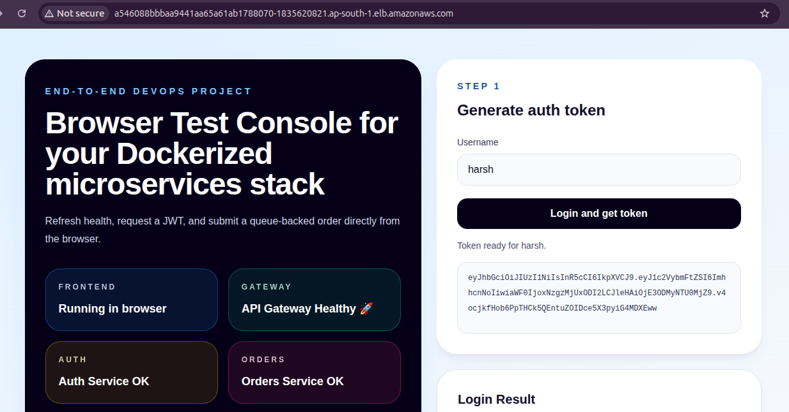

# Stage 5: Helm Packaging

Stage 5 converts the plain Kubernetes manifests from Stage 4 into a reusable Helm chart. The repo now includes a starter Helm scaffold plus dedicated Stage 5 command-sequence and file-structure docs.

## Goal

- Package Kubernetes manifests as a Helm chart.
- Move repeated values into `values.yaml`.
- Make image repository, image tag, namespace, replicas, ports, hosts, and secrets configurable.
- Keep the frontend as a `ClusterIP` service and expose it through an ingress controller backed by an AWS load balancer.
- Keep the deployment easy to install, upgrade, rollback, and uninstall.
- Prepare the project for CI/CD deployment in a later stage.

## Current Input

Stage 5 starts from the existing Stage 4 manifests:

```text
k8s/base/
```

Important resources to convert:

- namespace
- config map
- secret
- frontend deployment and service
- API gateway deployment and service
- auth service deployment and service
- orders service deployment and service
- order consumer deployment
- Redis deployment and service
- RabbitMQ deployment and service
- ingress

## Target Chart Structure

Recommended structure:

```text
helm/
`-- end-to-end-devops/
    |-- Chart.yaml
    |-- values.yaml
    |-- templates/
    |   |-- namespace.yaml
    |   |-- configmap.yaml
    |   |-- secret.yaml
    |   |-- frontend-deployment.yaml
    |   |-- frontend-service.yaml
    |   |-- api-gateway-deployment.yaml
    |   |-- api-gateway-service.yaml
    |   |-- auth-service-deployment.yaml
    |   |-- auth-service-service.yaml
    |   |-- orders-service-deployment.yaml
    |   |-- orders-service-service.yaml
    |   |-- order-consumer-deployment.yaml
    |   |-- redis-deployment.yaml
    |   |-- redis-service.yaml
    |   |-- rabbitmq-deployment.yaml
    |   |-- rabbitmq-service.yaml
    |   |-- ingress.yaml
    |   `-- _helpers.tpl
    `-- README.md
```

## Values to Parameterize

These values should move into `values.yaml`:

```yaml
namespace:
  name: end-to-end-devops

image:
  registry: 198452822403.dkr.ecr.ap-south-1.amazonaws.com
  tag: latest
  pullPolicy: IfNotPresent

services:
  frontend:
    repository: end-to-end-devops-dev-frontend
    port: 3000
    replicas: 1
    serviceType: ClusterIP
  apiGateway:
    repository: end-to-end-devops-dev-api-gateway
    port: 5000
    replicas: 1
    serviceType: ClusterIP
  authService:
    repository: end-to-end-devops-dev-auth-service
    port: 4000
    replicas: 1
    serviceType: ClusterIP
  ordersService:
    repository: end-to-end-devops-dev-orders-service
    port: 7000
    replicas: 1
    serviceType: ClusterIP
  orderConsumer:
    replicas: 1

redis:
  image: redis:7-alpine
  port: 6379

rabbitmq:
  image: rabbitmq:3-management-alpine
  amqpPort: 5672
  managementPort: 15672

ingress:
  enabled: true
  frontendHost: ""
  apiHost: ""

secrets:
  jwtSecret: replace-me
```

## Prerequisites

- Stage 3 infrastructure is active.
- Stage 4 Kubernetes manifests are working.
- App images are already pushed to ECR.
- `helm` is installed.
- `kubectl` is connected to the EKS cluster.
- An ingress controller is installed if you want AWS load balancer routing.

Add the ingress-nginx Helm repository, create a separate namespace for the controller, and install it there:

```bash
helm repo add ingress-nginx https://kubernetes.github.io/ingress-nginx
helm repo update
kubectl create namespace ingress-nginx
helm upgrade --install ingress-nginx ingress-nginx/ingress-nginx \
  --namespace ingress-nginx \
  --set controller.service.type=LoadBalancer
```

If Helm reports an ownership conflict for `ClusterRole`, `ClusterRoleBinding`, or `IngressClass`, clean up the old ingress-nginx resources first:

```bash
kubectl get clusterrole | grep ingress-nginx
kubectl get clusterrolebinding | grep ingress-nginx
kubectl get ingressclass
kubectl delete clusterrole ingress-nginx
kubectl delete clusterrolebinding ingress-nginx
kubectl delete ingressclass nginx
```

Check tools:

```bash
helm version
kubectl get nodes
```

## 1. Create the Helm Chart

When implementation begins:

```bash
mkdir -p helm
helm create helm/end-to-end-devops
```

Then remove the default generated templates and replace them with templates based on `k8s/base`.

## 2. Convert Manifests to Templates

Each Stage 4 manifest should become a Helm template.

Examples:

- hardcoded namespace becomes `{{ .Values.namespace.name }}`
- hardcoded image tag becomes `{{ .Values.image.tag }}`
- hardcoded image registry becomes `{{ .Values.image.registry }}`
- hardcoded replica count becomes a value under `services`
- frontend service type stays `ClusterIP`

## 3. Validate Templates Locally

Render the chart without installing:

```bash
helm template end-to-end-devops ./helm/end-to-end-devops
```

Lint the chart:

```bash
helm lint ./helm/end-to-end-devops
```

Render with custom image tag:

```bash
helm template end-to-end-devops ./helm/end-to-end-devops \
  --set image.tag=v1
```

## 4. Install to Kubernetes

Install the chart and set the JWT secret in one step:

```bash
helm upgrade --install end-to-end-devops ./helm/end-to-end-devops \
  --namespace end-to-end-devops \
  --create-namespace \
  --set secrets.jwtSecret='your-real-secret'
```

If you removed the ingress controller earlier and Helm fails with a webhook error such as `validate.nginx.ingress.kubernetes.io`, delete the stale ingress-nginx validating webhook first:

```bash
kubectl get validatingwebhookconfiguration | grep ingress
kubectl delete validatingwebhookconfiguration ingress-nginx-admission
```

Verify:

```bash
helm list -n end-to-end-devops
kubectl get all -n end-to-end-devops
```

Find the ingress controller address:

```bash
kubectl get svc -n ingress-nginx
```

Wait for the ingress controller `EXTERNAL-IP` field to populate, then open that address in your browser. The frontend service remains `ClusterIP`; traffic flows through the ingress controller and then to the frontend.

If the ingress controller is not installed yet, install one with a `LoadBalancer` Service before deploying the chart.

## 8. Uninstall Ingress Controller

When you are done with Stage 5, remove the ingress controller release first:

```bash
helm uninstall ingress-nginx -n ingress-nginx
```

Then delete the namespace:

```bash
kubectl delete namespace ingress-nginx
```

If Helm refuses to install the controller again later because of leftover cluster-scoped resources, remove the stale objects first:

```bash
kubectl get clusterrole | grep ingress-nginx
kubectl get clusterrolebinding | grep ingress-nginx
kubectl get ingressclass
kubectl delete clusterrole ingress-nginx
kubectl delete clusterrolebinding ingress-nginx
kubectl delete ingressclass nginx
```

## 5. Upgrade

After pushing a new image tag:

```bash
helm upgrade end-to-end-devops ./helm/end-to-end-devops \
  --namespace end-to-end-devops \
  --set image.tag=v2
```

Check rollout status:

```bash
kubectl rollout status deployment/frontend -n end-to-end-devops
kubectl rollout status deployment/api-gateway -n end-to-end-devops
kubectl rollout status deployment/auth-service -n end-to-end-devops
kubectl rollout status deployment/orders-service -n end-to-end-devops
```

## 6. Rollback

View release history:

```bash
helm history end-to-end-devops -n end-to-end-devops
```

Rollback to a previous revision:

```bash
helm rollback end-to-end-devops 1 -n end-to-end-devops
```

## 7. Uninstall

```bash
helm uninstall end-to-end-devops -n end-to-end-devops
```

If the namespace is not needed after uninstall:

```bash
kubectl delete namespace end-to-end-devops
```

## Secret Handling

Do not commit real secret values in `values.yaml`.
The default `secrets.jwtSecret: replace-me` value is only a placeholder.

Safer options:

- pass secrets with `--set secrets.jwtSecret=...`
- use a separate ignored values file such as `values.local.yaml`
- use External Secrets or AWS Secrets Manager in a later stage

Example ignored local values file:

```bash
helm upgrade --install end-to-end-devops ./helm/end-to-end-devops \
  --namespace end-to-end-devops \
  --create-namespace \
  -f values.local.yaml
```

## Completion Checklist

- Helm chart exists under `helm/end-to-end-devops`.
- Stage 4 manifests are converted into Helm templates.
- Stage 5 command sequence is documented.
- Stage 5 file structure is documented.
- `values.yaml` controls image tags, ports, replicas, namespace, hosts, and secret placeholders.
- `values.yaml` keeps the frontend as `ClusterIP` and routes traffic through ingress.
- `helm lint` passes.
- `helm template` renders valid Kubernetes YAML.
- `helm upgrade --install` deploys the app successfully.
- `helm upgrade` updates image tags successfully.
- `helm rollback` works.
- `helm uninstall` removes the release cleanly.

## Screenshots

The Stage 5 screenshots are stored in [screenshots/stage5-ss](../screenshots/stage5-ss/).





